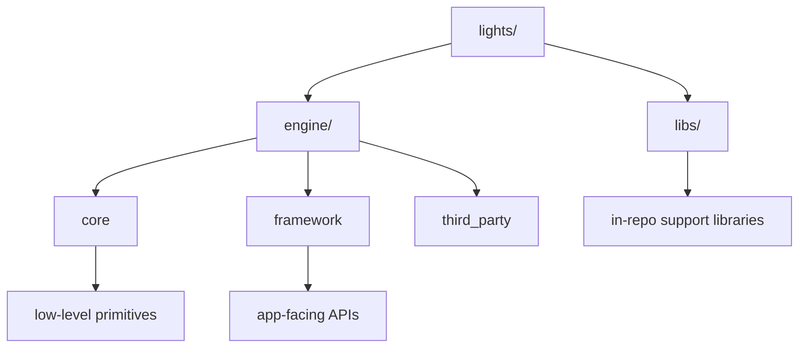

# Lights Engine Documentation

This is the rewritten documentation set for Lights. It is intentionally broad and detailed, including both concrete API behavior and explicitly labeled inferred/speculative design intent.

> Canonical docs entrypoint: `lights/docs/README.md`  
> Jekyll mirror entrypoint: `lights/docs/index.md`

## Documentation Map

### Architecture
- [Engine Architecture](./architecture/engine_architecture.md)
- [Client / Server Architecture](./architecture/client_server.md)
- [Engine Structure Reference](./architecture/engine_structure.md)

### Engine Subsystems
- [Core / Algo](./subsystems/core_algo.md)
- [Core / Audio](./subsystems/core_audio.md)
- [Core / Platform](./subsystems/core_platform.md)
- [Core / Rendering](./subsystems/core_rendering.md)
- [Core / Text](./subsystems/core_text.md)
- [Core / Util](./subsystems/core_util.md)
- [Framework / Game](./subsystems/framework_game.md)
- [Framework / Scene](./subsystems/framework_scene.md)
- [Framework / Input](./subsystems/framework_input.md)
- [Framework / Layers (Clay)](./subsystems/framework_layers_clay.md)

### Libraries and Third-Party
- [ozz_binarypacking](./libraries/ozz_binarypacking.md)
- [ozz_collision](./libraries/ozz_collision.md)
- [ozz_audio](./libraries/ozz_audio.md)
- [ozz_typegen](./libraries/ozz_typegen.md)
- [Third-Party Overview](./libraries/third_party_overview.md)

### Practical Guides
- [Network Protocol and Messages](./network/messages.md)
- [Usage Examples (including truck-kun)](./examples/usage.md)
- [Extending the Engine](./extending.md)

## High-Level Architecture

## How to Read This Set

1. Start with architecture docs.
2. Read subsystem docs for internals.
3. Read libraries docs for non-engine modules.
4. Use usage/extending guides for implementation patterns.

## About Inferred and Speculative Sections

Many chapters include:
- **Inferred intent**: behavior inferred from implementation patterns.
- **Speculative direction**: likely future evolution based on existing code structure/TODOs.

These sections are always labeled and should not be treated as committed roadmap guarantees.
