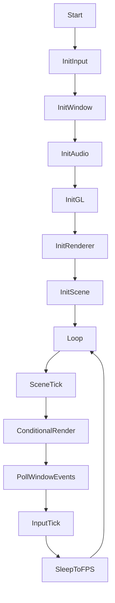
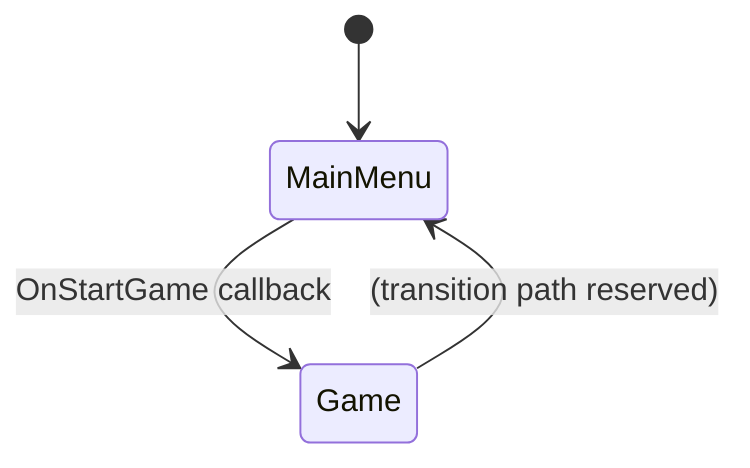
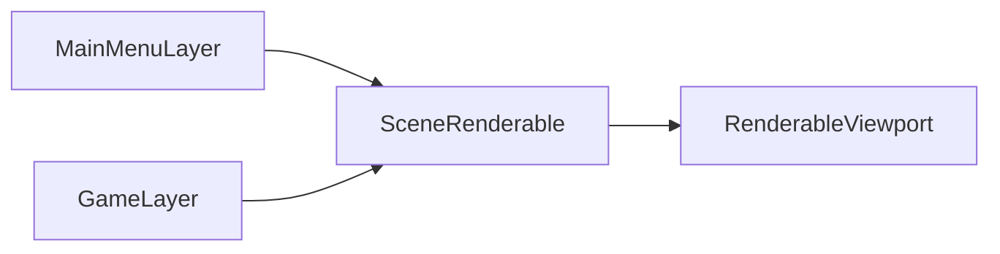

# Client / Server Architecture

This chapter describes the current client runtime architecture and the server-facing design intent implied by docs and code organization.

## Current Client Runtime (concrete)

`LightsGame<SceneType>::Run()` performs deterministic setup and then enters a main loop:

Key runtime characteristics:
- Config-driven startup (`Configuration<GameParameters>` from TOML).
- Scene tick + render decoupling using target FPS timing.
- Input polling converted into action/chord/axis mappings every frame.
- Resource manager tick integrated into the loop.

## truck-kun Scene State Example (concrete)

Truck-kun (`idkwtfim2D`) demonstrates scene-level state control:
- `MainStates::MainMenu` and `MainStates::Game`.
- Layer load/unload on state transitions (`LoadLayer`, `SetLayerActive`, `RemoveLayer`).
- Render graph reconnection when active layer changes.

## Render Composition Pattern (concrete)

The client composes layer output through graph-connected renderables:

## Server and Network Intent (inferred)

The repository currently contains limited concrete network runtime code in this engine layer, but architecture/docs imply:
- separation of connection/auth lifecycle from gameplay state;
- state-machine driven progression (connect/auth/load/in-game);
- binary message transport with typed payload contracts.

See [Network Protocol and Messages](../network/messages.md) for currently documented contracts and inferred expansion paths.
