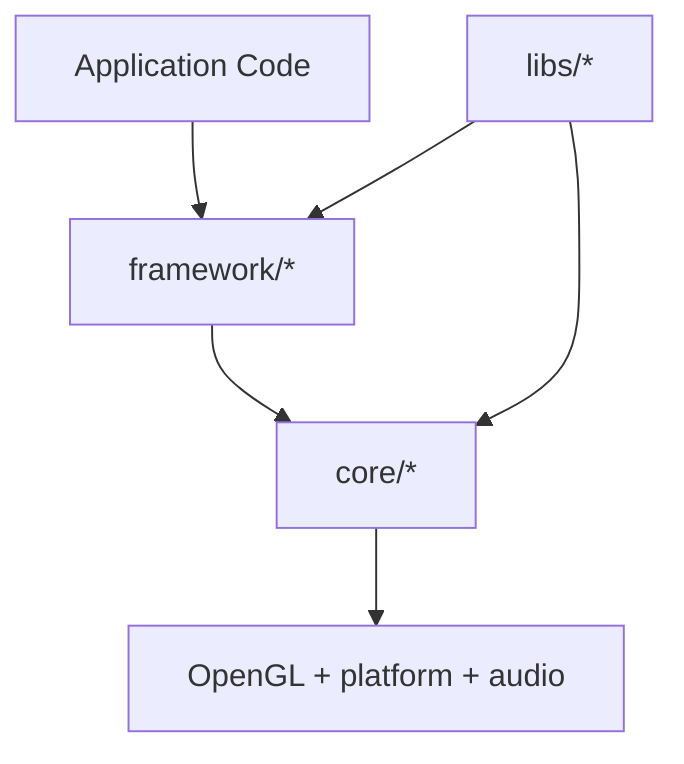

# Engine Architecture

Lights is organized as a layered engine with a low-level primitive tier and a higher-level application tier.

## Layer Model

## Core Layer (`engine/include/lights/core/*`)

Purpose: low-level systems, explicit control, composable primitives.

Subsystems:
- `algo`: graph utilities (`GraphNode`) used by render/audio execution.
- `audio`: runtime audio graph, device selection, cue/synth/mixer nodes.
- `platform`: backend-neutral window/input bridge (GLFW/SDL3).
- `rendering`: render graph execution primitives and GL object wrappers.
- `text`: font atlas generation via FreeType.
- `util`: generic helpers (configuration, state machine, image/ring buffer, enum helpers, etc.).

## Framework Layer (`engine/include/lights/framework/*`)

Purpose: application-oriented composition on top of core primitives.

Subsystems:
- `game`: `LightsGame<SceneType>` bootstrap + game loop orchestration.
- `scene`: scene/layer lifecycle and resource loading pipeline.
- `input`: action/chord/axis abstraction over keyboard/mouse/gamepad.
- `layers/clay`: immediate-mode UI layer integrated into render graph.

## Inferred Design Intent

- **Graph-driven execution**: both rendering and audio use node graphs with topological ordering.
- **Thin abstractions over explicit systems**: wrappers are minimal; concrete behavior remains visible.
- **Composable scene architecture**: layers are loaded/removed dynamically and selected by name.
- **Progressive abstraction**: framework should cover common patterns while keeping core APIs available.

## Speculative Direction (labeled)

Based on source patterns/TODOs:
- render graph validation and safety checks likely to expand;
- audio node ecosystem likely to grow beyond cue/saw/mixer;
- resource manager job/render split likely to be further formalized;
- optional backend paths (e.g., SDL3/asio) likely to mature over time.

## Relationship to File Structure

Use [Engine Structure Reference](./engine_structure.md) for directory-level inventory.
