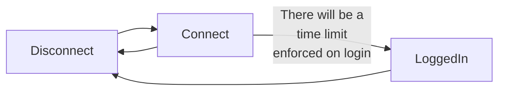
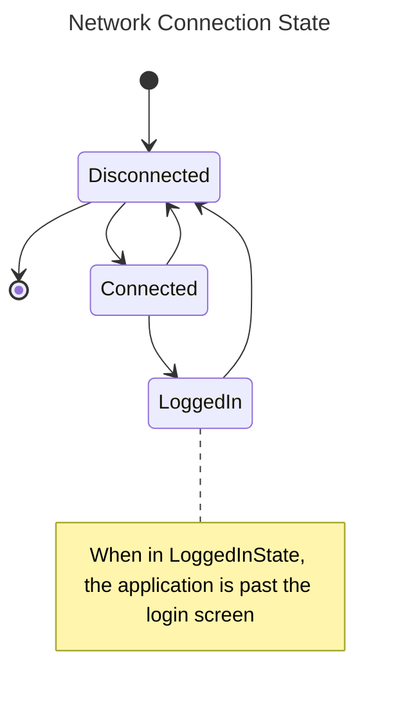
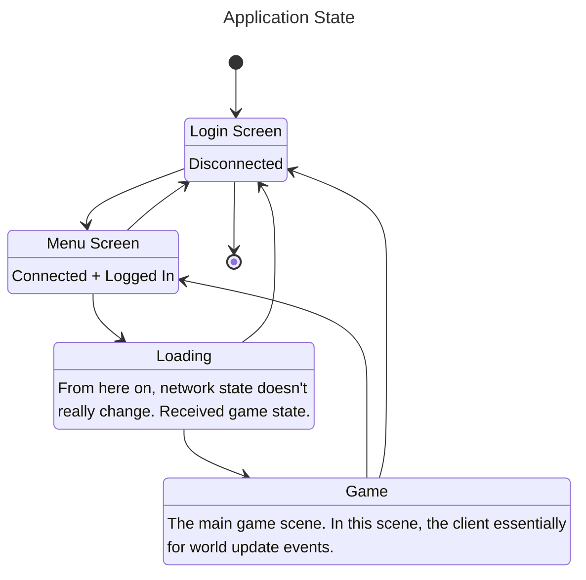
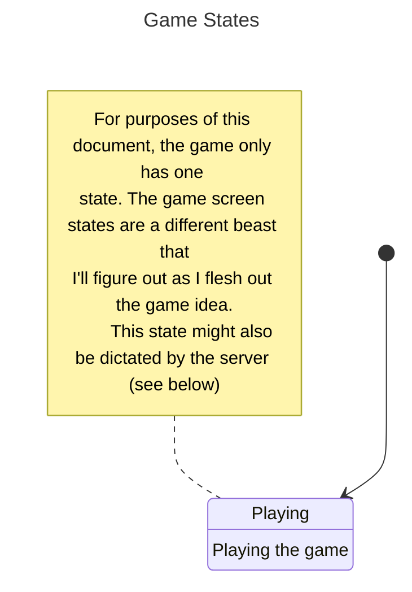
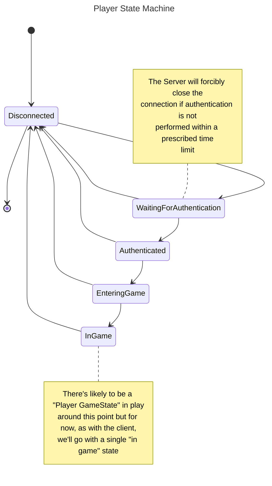
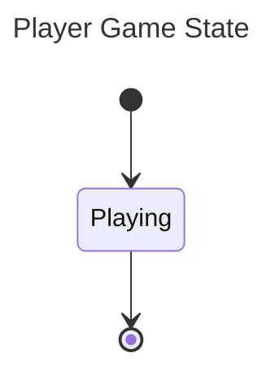
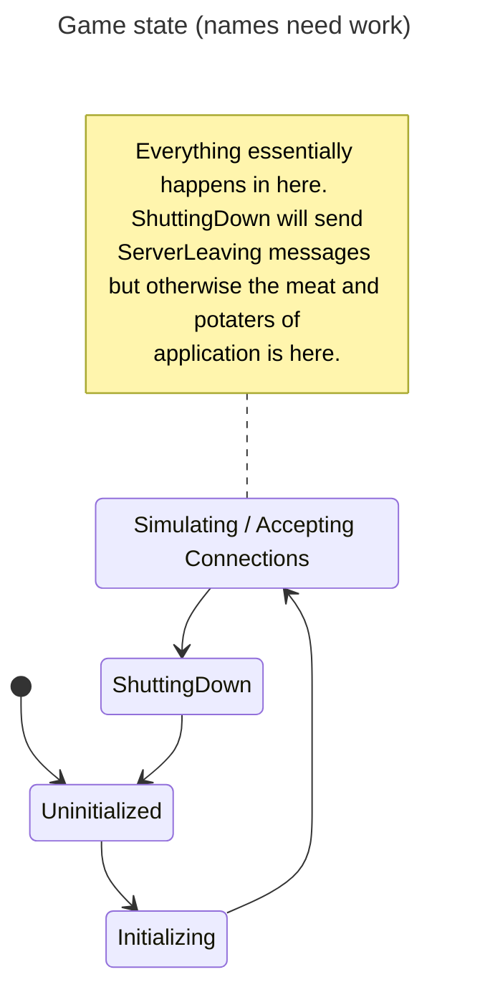

# Network Communications and General Application flow

The server is going to be as authoritative as possible and hold all game state within its cache, with some form of game state 
backing up happening every so often. This backup process will be thought of later.

As of writing, the application / connection flow looks like this:

Additionally, the current state of the application contains no "game". The client at the moment is simply 2 quads 
rendered locally on a cornflower blue background. One of these quads can be moved with the arrow keys [commit](https://github.com/Ozzadar/Lights/commit/9a8a0a4cf3b93f69030b7e37261d31f074284f36)

The purpose of this document is essentially to brainstorm what the server and client statemachines might look at -- ultimately
landing on a rough first draft of the statemachines and messages that will be exchanged between the server and client.

## Client State

The client itself will probably have a couple "application level" state machines.

1. Network connection state (Connected, Connecting, Connected, LoggedIn)
2. Application Screen State (Login Screen, Main Menu Screen / Character Select, Loading, Game Screen)
3. Game State [within the game screen]. (TBD as game not yet designed)

## Server Things

The way the server is currently architected, it will asynchronously accept new connections while running the main server loop on another.
This is very similar to the way that client is set up but without the "screen states", and the "network states" being simplified down to "Waiting for Connections".

Therefore for purposes of this discussion there are 2 main state machines:

1. Central Ticking "Game" State Machine
2. Player State Machine (essentially the client's Network State machine, augmented with some more game specific states)
3. Player Game State

## MESSAGES! THE WHOLE REASON THIS DOCUMENT EXISTS

Laying out the various states for everything was all in preparation for starting to formalize the messages that are required
to enable these systems. So here's my attempt at a sequence diagram attempting to define some of these messages at the highest of levels.

Hopefully, mermaid will let me section off various sections to overlap with different states I described above.

```mermaid
---
    title: Messages
---
sequenceDiagram
%%    autonumber
    participant C as Client
    participant S as Server
    
    %% Client Connect and Authenticate
    rect rgb(25,25,25)
        activate C
        critical Connect to Server
            C-->S: Connect
        end
        note over C, S: The Server will disconnect the client <br/>if authentication isn't performed <br/> quickly
        C->>S: AuthenticationRequest
        deactivate C
        
        activate S
        alt success
        S->>C: AutenticationSuccessful
        else failure
        S->>C: AuthenticationFailed
        S-->C: Disconnect
        deactivate S
        end
    end
    
    rect rgb(70,50,50)
        activate C
        C->>S: EnterGame
        deactivate C
        
        activate S
        par Send initial state
            S->>C: InitialPlayerState
            S->>C: NearbyPlayerStates
            and
            S->>C: WorldState
        end
        deactivate S
    end

    rect rgb(50,70,50)
        par In Game Loop
            loop ServerTicking 
                S->>C: UpdateWorldState
                S->>C: UpdatePlayerState
                S->>C: UpdateNearbyPlayerStates
            end
        and
            loop ClientTicking
                C->>S: PlayerInput
            end
        end
    end
```

