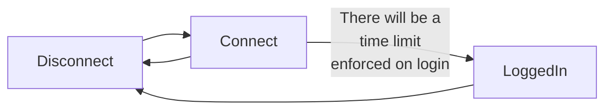
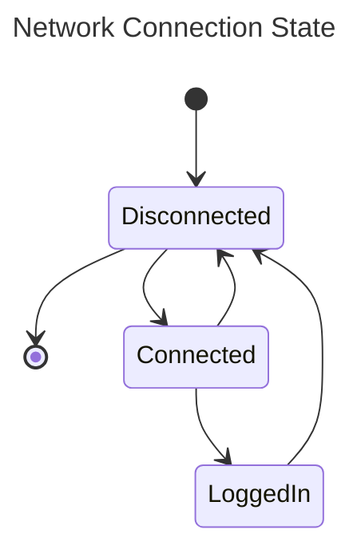
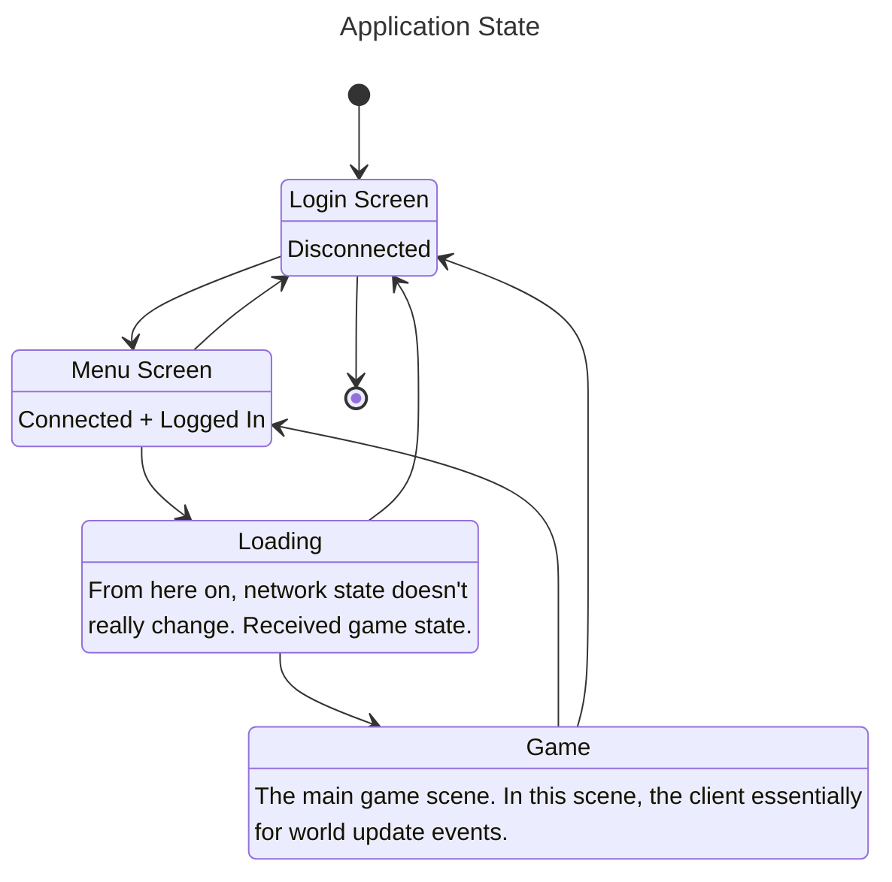

# Network Communications and General Application flow

The server is going to be as authoritative as possible and hold all game state within its cache, with some form of game state 
backing up happening every so often. This backup process will be thought of later.

As of writing, the application / connection flow looks like this:

Additionally, the current state of the application contains no "game". The client at the moment is simply 2 quads 
rendered locally on a cornflower blue background. One of these quads can be moved with the arrow keys [commit](https://github.com/Ozzadar/Lights/commit/9a8a0a4cf3b93f69030b7e37261d31f074284f36)

The purpose of this document is essentially to brainstorm what the server and client statemachines might look at -- ultimately
landing on a rough first draft of the statemachines and messages that will be exchanged between the server and client.

## Client State

The client itself will probably have a couple "application level" state machines.

1. Network connection state (Connected, Connecting, Connected, LoggedIn)
2. Application Screen State (Login Screen, Main Menu Screen / Character Select, Loading, Game Screen)
3. Game State [within the game screen]. (TBD as game not yet designed)

