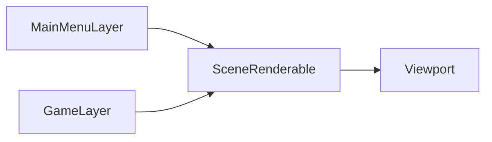

# Usage Examples

This chapter shows practical usage patterns, starting from minimal setup and then mapping to truck-kun.

## Minimal Bootstrap

```cpp
#include <lights/framework/game/game.h>
#include <lights/framework/scene/scene.h>

class MyScene : public OZZ::scene::Scene {
public:
    void InitScene(std::shared_ptr<OZZ::InputSubsystem> input,
                   OZZ::scene::ResourceManager* resourceManager) override {
        Scene::InitScene(input, resourceManager);
    }

    OZZ::Renderable* GetSceneGraph() const override {
        return nullptr; // replace with your render graph root
    }
};

int main() {
    OZZ::game::LightsGame<MyScene> game{"clientConfig.toml"};
    game.Run();
}
```

## truck-kun: Concrete Integration Pattern

### 1) Application entry

From `truck-kun/idkwtfim2D/src/main.cpp`:

```cpp
const auto configFilePath = std::filesystem::current_path() / "clientConfig.toml";
OZZ::game::LightsGame<GameScene> game{configFilePath};
game.Run();
```

### 2) Scene lifecycle + state machine

From `game_scene.cpp`:
- calls `Scene::InitScene(...)`;
- creates and starts `StateMachine<MainStates>`;
- transitions between `MainMenu` and `Game`;
- loads/unloads layers with `SceneLayerManager`.

### 3) Layer composition



The active layer is connected to a scene renderable, then presented through the viewport pass.

### 4) Input mappings in practice

truck-kun uses:
- action mappings (`RegisterInputMapping`) for menu and gameplay actions;
- axis mappings (`RegisterAxisMapping`) for analog/directional movement;
- mixed keyboard/gamepad chords for common actions.

## Inferred Best Practices

- Treat `Scene` as orchestration, not heavy gameplay logic.
- Keep gameplay/UI in separate layers and switch through explicit state transitions.
- Keep render graph wiring explicit (`GraphNode::Connect` / `ClearConnections`) when state changes.
- Use `ResourceManager` for texture/spritesheet loading to align with engine upload flow.
