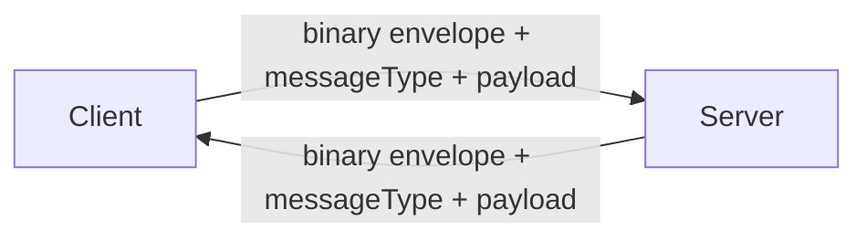
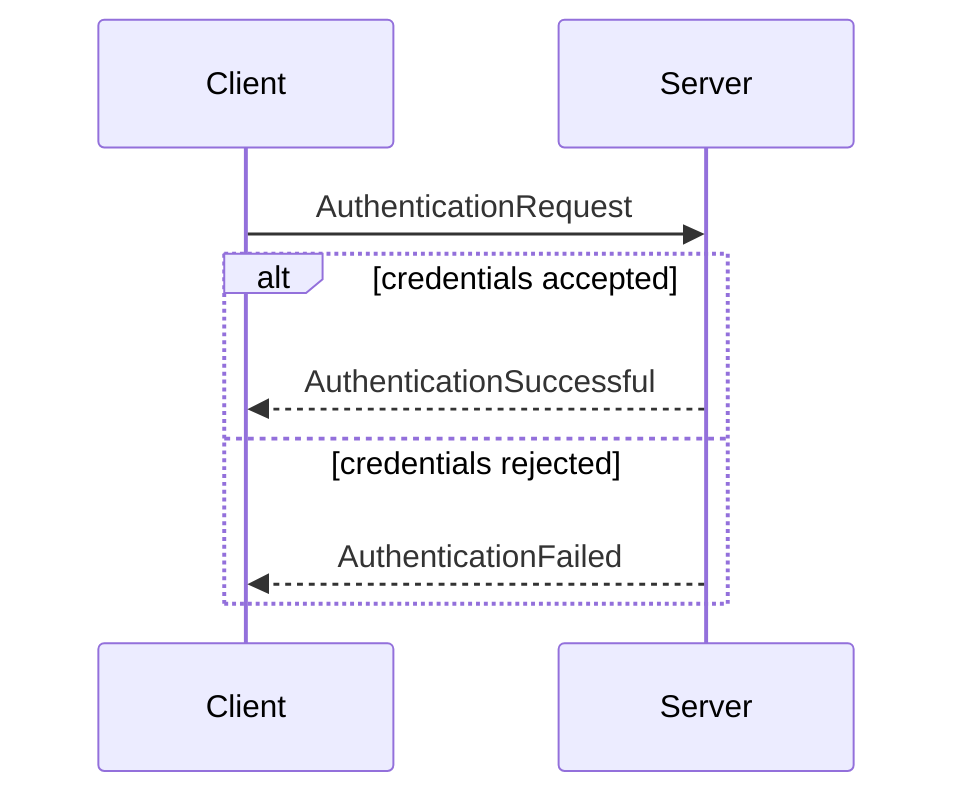

# Network Protocol and Messages

This chapter documents the currently captured message contract and the inferred protocol shape around it.

> Note: payloads are represented as JSON for readability. Transport is expected to be binary with message type identifiers.

## Wire-Level Intent (inferred)



Observed and inferred protocol properties:
- messages are type-discriminated (`messageType`);
- payloads are compact and strongly typed on each side;
- auth/login forms the first concrete protocol slice.

## Currently Documented Messages (concrete)

## Client -> Server

### AuthenticationRequest
```json
{
  "username": "string",
  "password": "string"
}
```

## Server -> Client

### AuthenticationSuccessful
```json
{
  "username": "string"
}
```

### AuthenticationFailed
```json
{}
```

### AccountLoggedInElsewhere
```json
{}
```

## Inferred Lifecycle



## Speculative Expansion (labeled)

Given current scene/game-state architecture, likely message families include:
- session/connection state updates (timeouts, reconnect, kick reasons);
- world or entity state deltas for gameplay synchronization;
- game-state transition events (menu/loading/in-game boundaries);
- player action commands acknowledged by authoritative server state.

These are not yet committed protocol contracts and should be treated as directional.
