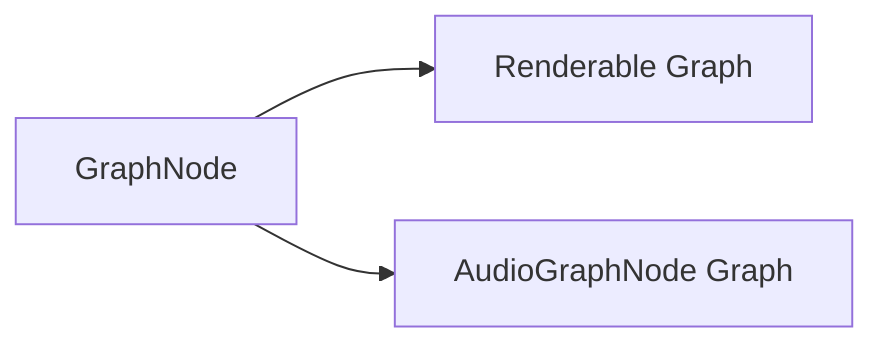

# Core Subsystem: Algo

Path: `engine/include/lights/core/algo/*`

## What It Contains

The algo subsystem currently centers on `GraphNode`, a directed graph primitive used by higher-level execution systems.

Key API:
- `GraphNode::Connect(from, to)`
- `GraphNode::Disconnect(from, to)`
- `GraphNode::TopologicalSort(root)`
- `GraphNode::Flatten(root)`
- `GraphNode::AreConnected(from, to)`
- `GraphNode::ClearConnections(node)`

## Runtime Role

`GraphNode` is the execution-order backbone for:
- render graph node execution (`Renderable` graph);
- audio graph node execution (`AudioGraphNode` graph).

## Behavioral Notes (concrete)

- `Connect` is duplicate-safe and updates both `outputs` and `inputs`.
- `TopologicalSort` returns `nullopt` on unprocessable graphs (e.g., cycle-like conditions).
- `Flatten` traverses both upstream (`inputs`) and downstream (`outputs`) links from a root.
- `ClearConnections` disconnects both incoming and outgoing edges.

## Inferred Design Intent

- Keep graph primitive generic and reusable across systems.
- Favor explicit, inspectable connection topology over hidden scheduling.

## Speculative Direction (labeled)

Likely future expansion:
- richer graph validation/debug tooling;
- stronger cycle diagnostics;
- optional typed graph wrappers per domain (render/audio/other).
