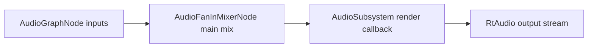

# Core Subsystem: Audio

Path: `engine/include/lights/core/audio/*`

## What It Contains

Core audio provides:
- device/stream lifecycle (`AudioSubsystem`);
- graph-based audio node execution (`AudioGraphNode` + `GraphNode`);
- built-in node types:
  - `AudioFanInMixerNode`
  - `AudioCue`
  - `SawToothNode`

## Architecture

## AudioSubsystem (concrete)

`AudioSubsystem` responsibilities:
- initialize/shutdown RtAudio backend;
- detect available devices;
- select output device and open stream;
- execute graph in audio callback;
- resample mix output to match device sample rate when needed.

Important behaviors:
- nodes are created through `CreateAudioNode<T>()` after subsystem init;
- graph execution order is derived via `GraphNode::TopologicalSort(mainMixNode)`;
- output data is expected as normalized float PCM.

## Built-In Nodes (concrete)

### AudioFanInMixerNode
- sums audio from all connected inputs;
- normalizes by `1 / inputCount` when inputs exist.

### AudioCue
- loads file data through `ozz_audio::Loader`;
- supports play state and loop mode (`None`, `Loop`, `PingPong`);
- renders silence when stopped/invalid/exhausted.

### SawToothNode
- procedural oscillator;
- configurable note/octave to frequency mapping;
- writes stereo sample frames.

## Inferred Design Intent

- keep audio graph modular and composable;
- allow both file-backed and procedural sources;
- make runtime device switching explicit in subsystem API.

## Known Gaps / Speculative Direction

From implementation TODOs and current behavior:
- channel conversion handling is incomplete;
- ping-pong loop mode path is scaffolded but not fully implemented;
- richer node library (filters/envelopes/effects) is a likely future direction.
