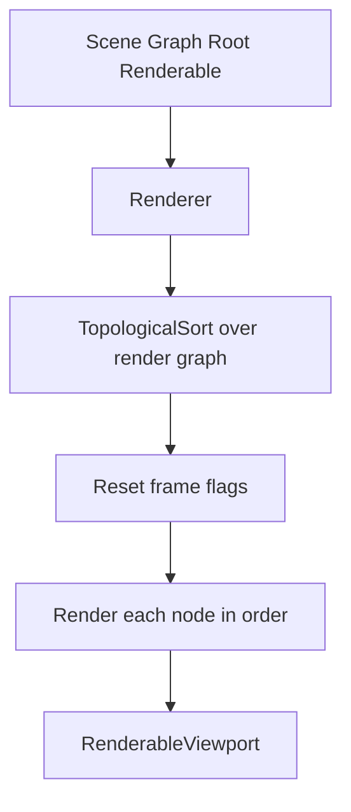

# Core Subsystem: Rendering

Path: `engine/include/lights/core/rendering/*`

## What It Contains

Core rendering provides GL-facing primitives and render graph execution:
- `Shader`, `Texture`, `Buffer`, `IndexVertexBuffer`
- `Material`
- `RenderTarget`
- `Renderable` (graph node base for render passes)
- `Renderer` (graph executor)
- `RenderableViewport` (final composition pass)

## Execution Flow

## Data Model (concrete)

### Renderable
- derives from `GraphNode`;
- provides named outputs (`renders` map);
- can declare required named inputs;
- tracks per-frame render status.

### Material
- binds shader + uniforms + textures + storage buffers;
- controls draw mode and draw-time settings (line width, scissor, etc.).

### RenderTarget
- either viewport target or texture-backed framebuffer;
- handles creation, attachment, resize, and bind/unbind.

### Buffers
- `Buffer`: generic GL buffer wrapper.
- `IndexVertexBuffer`: VAO + vertex/index upload and binding.
- `GPUStagingBuffer`: persistent mapped PBO with ring-buffer allocation and in-flight fences.

## Inferred Design Intent

- explicit graph wiring for pass composition;
- minimal abstraction over GL operations for debuggability;
- resource upload path that can evolve toward robust async streaming.

## Speculative Direction (labeled)

Likely future work based on TODOs/patterns:
- render graph validation and stronger pass contracts;
- expanded render pass semantics beyond current texture/viewport targets;
- deeper async upload orchestration and synchronization tooling.
