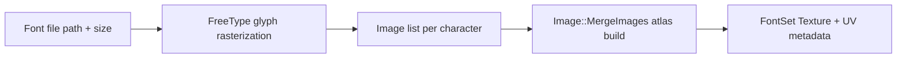

# Core Subsystem: Text

Path: `engine/include/lights/core/text/*`

## What It Contains

Core text currently centers on `FontLoader` and `FontSet`.

Main responsibilities:
- load font faces with FreeType;
- generate glyph atlas textures for a predefined character set;
- store glyph metrics (`CharacterDetails`);
- provide text measurement (`FontSet::MeasureText`).

## Character Pipeline (concrete)

## Notable Behaviors

- Character set is currently a fixed ASCII-like list (`FontLoader::CharacterSet`).
- Glyph metrics include UV, size, bearing, and advance values.
- `MeasureText` computes width from glyph advance and vertical bounds from bearing/size.

## Inferred Design Intent

- generate reusable font atlases per `(fontPath, fontSize)` pair;
- keep text measurement and texture generation close to rendering needs;
- support immediate-mode UI text rendering through shared font atlas resources.

## Speculative Direction (labeled)

Potential future additions:
- broader Unicode support and dynamic glyph sets;
- fallback fonts and missing-glyph handling;
- atlas packing/kerning improvements.
