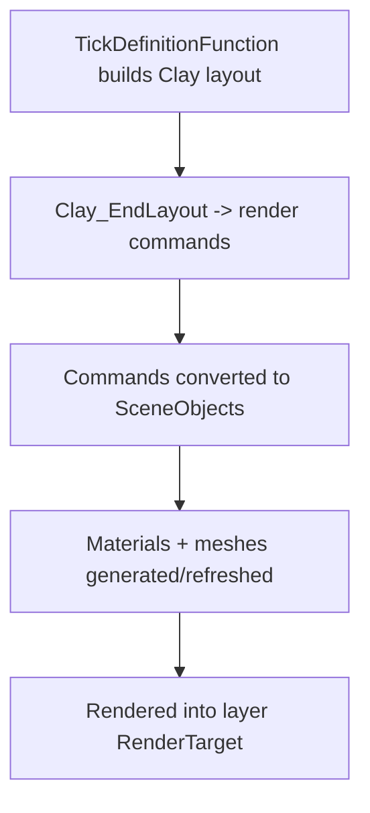

# Framework Subsystem: Layers / Clay UI

Path: `engine/include/lights/framework/layers/clay/*`

## What It Contains

This subsystem integrates the Clay layout engine into Lights rendering:
- `ClayUILayer` (`SceneLayer` + `Renderable`)
- component helpers:
  - `ClayComponent`
  - `ClayPanel`
  - `ClayCanvasPanel`
- utility wrappers (`clay_utils.h`) for texture ownership handoff.

## Rendering Pipeline (concrete)

## Core Behavior

`ClayUILayer` responsibilities:
- initialize Clay arena and measurement hooks;
- track pointer/scroll input from `InputSubsystem`;
- manage UI shaders/materials/textures;
- convert Clay render commands (rect, border, image, text, scissor) into draw-ready scene objects;
- render to a texture target for composition with other layers.

Font integration:
- registers font IDs to paths;
- uses `FontLoader` to create atlas textures;
- caches atlas textures for text rendering.

## Inferred Design Intent

- provide immediate-mode UI as a first-class scene layer;
- keep UI rendering graph-compatible via `Renderable` contract;
- permit composition with gameplay layers through shared render target plumbing.

## Speculative Direction (labeled)

Likely growth areas:
- richer reusable Clay component library;
- optimization of command diffing/object rebuild costs;
- stronger ownership/lifetime ergonomics for wrapped UI textures.
