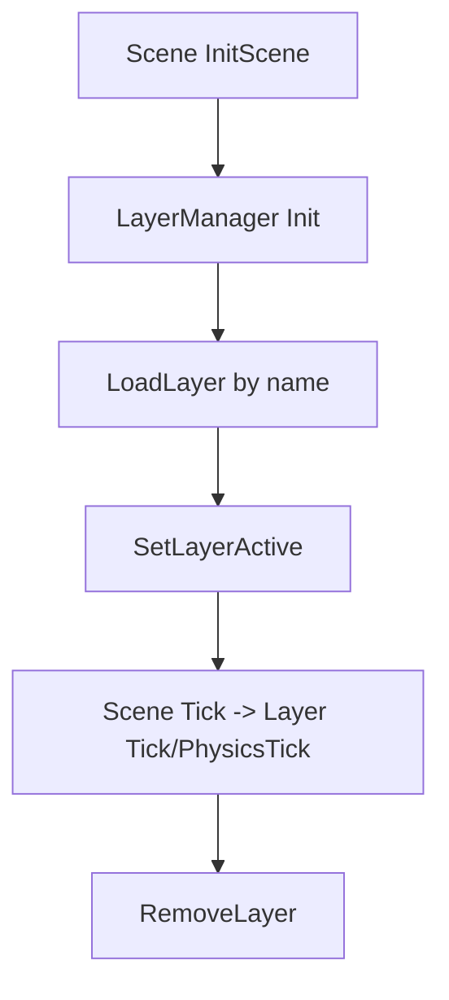

# Framework Subsystem: Scene

Path: `engine/include/lights/framework/scene/*`

## What It Contains

Scene subsystem defines application-level composition:
- `Scene` base class
- `SceneLayer` abstraction
- `SceneLayerManager` dynamic layer container
- `SceneObject` render unit container
- `ResourceManager` async-style resource staging and render job execution
- constants/units helpers for world-space conversions

## Layer Lifecycle Model (concrete)

Key `SceneLayerManager` features:
- dynamic load/remove by string name;
- stable slot reuse to avoid index invalidation;
- active layer set + execution order sorting;
- optional immediate init for layers loaded after manager initialization.

## ResourceManager Pipeline (concrete)

Additional capabilities:
- spritesheet metadata loading/parsing from JSON;
- animation frame grouping and sorting by frame index.

## Inferred Design Intent

- keep scene orchestration explicit and modular;
- isolate resource upload complexity from gameplay code;
- allow layered gameplay/UI/system composition with runtime switching.

## Speculative Direction (labeled)

Likely evolution:
- stronger separation of resource I/O vs render-thread upload concerns;
- expanded scene graph tooling around layer dependencies and diagnostics;
- improved job scheduling/backpressure behavior.
